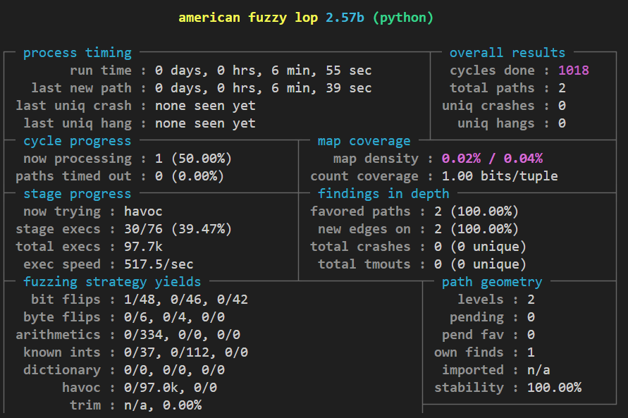

# Fuzzing testing e-Voting Server
In this section, we will be using python-afl to perform fuzzing tests on gRPC. The following will describe the usage.
## Usage
### Install python-afl
* ```pip install python-afl```
### Runing python-afl
* ```py-afl-fuzz -o results-path/ -i /path/to/examples -- /path/to/python /path/to/your/test/script.py```
### Experiment result
We perform fuzzing tests on PreAuth, a server function, using python-afl. Results are as follows:  
